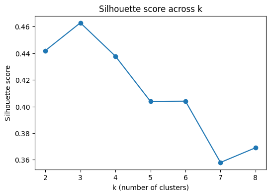

# Structured Content Archetype Clustering: Finding Natural Performance Groups in a Real Content Inventory

## Abstract

This project asks whether a large, real-world content inventory naturally separates into distinct performance archetypes based on safe, observable search and engagement signals. Using K-Means clustering on structured metrics from the FlyRank internship warehouse (March 2026), 77,165 content pages were grouped into three archetypes, validated against a client-grouped holdout of unseen clients. The resulting clusters — a large dormant/low-demand group, a visible-but-disengaged group, and a small niche-engaged group — reveal a picture of the inventory that a single hand-written baseline rule, which flagged only 17 pages, could not surface. Each archetype is mapped to a concrete content action.

## Introduction / Problem Statement

Reviewing thousands of content pages individually to decide what to protect, refresh, rewrite, or prune is not scalable for a small content team. The question this project addresses is: **what recurring performance archetypes exist across the content inventory, based on safe engagement and visibility metrics — and what decision does each archetype support?**

The decision this supports: instead of a content strategist reviewing every page one by one, they can apply a consistent, evidence-based treatment per archetype — protect, improve, rewrite, merge, prune, or monitor — spending limited review time where it matters most. A wrong classification mostly costs misallocated attention (reviewing a page that didn't need it, or leaving a genuinely underperforming page unreviewed), rather than a single irreversible action, since archetypes guide strategy rather than one specific edit.

A fixed if/else rule cannot capture this well: with six interacting numeric signals across tens of thousands of pages, no small set of hand-written thresholds can reveal the natural groupings the way clustering can.

## Data

- **Release:** FlyRank/internship-warehouse (Hugging Face), build `v20260703`
- **Tables used:** `fact_content_daily_performance`, filtered to a single mid-panel month
- **Time window:** March 2026 (`month=2026-03`) — deliberately not the `_sample` table, which is the sealed final month (June 2026) and reserved to avoid leaking future information into feature logic
- **Excluded:** raw text, URLs, titles, and client names — only pseudonymized IDs (`content_hash_id`, `client_hash_id`) and structured numeric/categorical signals are used. No product-computed decision flags exist in this release, so none could be (or were) used as inputs.

## Methodology

**Assumptions:** a single month of observed behavior is enough to characterize a page's typical performance pattern; pages behave in ways captured by search and engagement metrics alone (no article text is available in this release, so this is not semantic clustering).

**Features (6, all computed strictly within the March 2026 window):**
- `impressions_month`, `clicks_month` — search visibility signals
- `avg_position_month` — average search ranking position
- `sessions_month`, `engagement_rate_month` — analytics activity
- `scroll_events_month` — on-page engagement depth

Skewed count-based features were log-transformed, then all features were median-imputed and standard-scaled before clustering.

**Label:** none — clustering is unsupervised. Cluster membership is the output, not a prediction against a ground-truth label.

**Baseline:** a hand-written rule from an earlier stage of this project — flag pages where `days_since_last_update >= 180` AND `impressions_90d >= 500`, output as a single `stale_visible_page` reason code with a `refresh_review` action.

**Validation design:** client-grouped holdout. 20% of clients were held out entirely before clustering; the model trained only on the remaining 80% of clients, then cluster assignment was applied unchanged to the unseen clients' pages to check whether the structure generalizes.

**Model selection:** K-Means, with *k* swept from 2 to 8. Silhouette score (computed on a 5,000-point random sample per *k*, for computational tractability) was used alongside manual inspection of cluster profiles to select *k* = 3.

**Leakage discipline:** every feature is calculated only from March 2026 data. No future-window columns and no label-derived fields were used as clustering inputs.

## Results

**Model selection:** *k* = 3 was chosen based on the silhouette sweep and interpretability of the resulting profiles.

**Validation:**
| Split | Silhouette score |
|---|---|
| Training (80% of clients) | 0.463 |
| Holdout (20% of clients, unseen) | 0.505 |

The holdout score is close to — and slightly above — the training score, suggesting the archetype structure generalizes to clients the model never saw, rather than overfitting to training-client quirks.

**Cluster profiles (medians):**

| Cluster | Impressions | Clicks | Avg. position | Sessions | Engagement rate | Scroll events | Pages |
|---|---|---|---|---|---|---|---|
| 0 — Visible but disengaged | 1,189.0 | 6.0 | 9.93 | 25.0 | 0.0 | 4.0 | 21,048 |
| 1 — Dormant / low-demand | 5.0 | 0.0 | 6.95 | 1.0 | 0.0 | 0.0 | 54,806 |
| 2 — Niche engaged | 14.0 | 1.0 | 7.01 | 2.0 | 0.5 | 1.0 | 1,311 |

**Comparison to baseline:** the hand-written baseline rule (stale + visible → refresh_review) flagged only **17 pages** out of 77,165 — a narrow, high-precision filter. Clustering instead organizes the entire inventory into three qualitatively different behavioral segments, most notably surfacing the large dormant/low-demand cluster (54,806 pages, ~71% of the inventory) that the flat rule never specifically identifies, since that rule checks only staleness and visibility, not overall engagement or demand level.

These two outputs are not directly comparable in scale: the baseline is a precision-first filter for a small, high-confidence set, while clustering is a comprehensive segmentation of the full inventory. A fairer future comparison would restrict clustering's output to just the 17 baseline-flagged pages, to see which archetype those pages fall into and whether the two methods agree on that specific subset.

.png)

## Limitations & Honest Framing

- **Single-month snapshot:** this analysis uses March 2026 only; archetypes may shift across seasons or as pages age.
- **Client imbalance:** the top single client contributes 17.3% of all pages in this slice, so cluster shapes may be somewhat influenced by that client's specific behavior patterns rather than representing every client evenly.
- **Not causal:** these are observed behavioral groupings, not causal categories. Belonging to a cluster does not guarantee that a given action (refresh, prune, etc.) will produce a specific outcome.
- **Not semantic clustering:** no article text was used — only structured metrics and metadata. This should not be confused with meaning-based content clustering.
- **Decision-support only:** no claim is made about Google's ranking algorithm, nor that any content action causes a change in performance. Results are directional and observational.

## Ranked Recommendations

| Archetype | Cluster | Size | Recommended action |
|---|---|---|---|
| Dormant / low-demand | 1 | 54,806 | Prune candidate — review for consolidation or removal |
| Visible but disengaged | 0 | 21,048 | Improve / rewrite — investigate why traffic isn't converting to engagement |
| Niche engaged | 2 | 1,311 | Protect / monitor — small but high-quality segment worth preserving |

These recommendations are a starting lens for human review, not an automated decision — a content strategist should validate a sample from each archetype before acting on the full group.

## Reproducibility

- **Repository:** [GitHub — flyrank-internship-ml](https://github.com/Iqra-Jahangir/flyrank-internship-ml)
- **Weekly notebooks:** `work/notebooks/w01_research_question.ipynb` through `w04_baseline_score.ipynb`
- **Capstone notebook:** `work/notebooks/capstone.ipynb`

All feature engineering, clustering, and validation code is available in the capstone notebook; re-running it end to end reproduces this paper's figures and tables (silhouette scores may vary slightly run to run due to K-Means' random initialization, controlled here with `random_state=42`).

## Acknowledgments & Data Credit

Built on the FlyRank ML Internship dataset. [flyrank.ai](https://flyrank.ai)